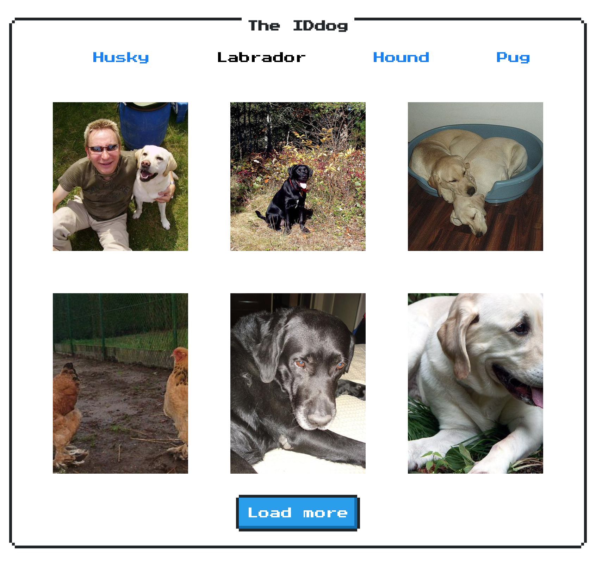

# IDdog



This project was bootstrapped with [Create React App](https://github.com/facebook/create-react-app).

## Run the project locally

**1 -** Clone the project and install the dependencies:

```
$ git clone https://github.com/lucasjs/iddog
$ cd iddog
$ npm install
```

**2 -** Run development mode:

```
$ npm run dev
```
Open [http://localhost:3000](http://localhost:3000) to view it in the browser.


## Scripts

Build:

```
$ npm run build
```
